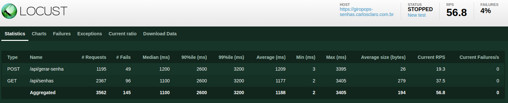
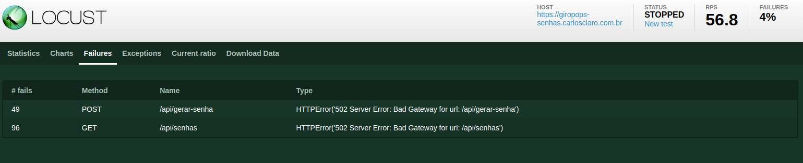

# Desafio Day 14 - Autoscaling com giropops-senha e locust

Neste desafio vamos montar um cluster no [MeuHomeLab](https://github.com/Carlos-Claro/descomplicando-kubernetes/tree/main/labs), utilizando a imagem do linuxtips/giropops-senhas que melhoramos com chainguard e está alocado em [carlosclaro/giropops-senhas](https://hub.docker.com/repository/docker/carlosclaro/goropops-senhas/general).\
Iremos realizar o teste de stress com [Locust](https://docs.locust.io/en/stable).\
Para isso iremos expor os componentes nos seguintes endereços:
- [giropops-senhas](https://giropops-senhas.carlosclaro.com.br) 
- [locust](https://locust.carlosclaro.com.br)

Para isso, utilizamos os seguintes arquivos:
- [giropops-senhas-deployment.yaml](./giropops-senhas-deployment.yaml) - Arquivo de montagem da imagem melhorada com chainguard do giropops-senhas, e do redis chainguard. Já com seus limites, levando em conta o uso mínimo do pod, como abaxo:
```
> kubectl top pods
NAME                                CPU(cores)   MEMORY(bytes)   
giropops-senhas-em-standby          1m           34Mi 
resources: 
  limits:
  cpu: 20m
  memory: 96Mi
```
- [giropops-senhas-service.yaml](./giropops-senhas-service.yaml) - expose os serviços de giropops-senhas e redis, para a aplicação utilizar
- [giropops-senhas-ingress.yaml](./giropops-senhas-ingress.yaml) - expose a aplicação giropops-senhas no endereço [https://giropops-senhas.carlosclaro.com.br](giropops-senhas.carlosclaro.com.br), utilizando certificado secretName: giropops-senhas-carlosclaro-tls-prod
- [giropops-senhas-hpa.yaml](./giropops-senhas-hpa.yaml) - aplica as regras de - Resource de CPU e Memoria tanto para o redis como para o giropops-senhas, levando em conta que o pod em standby utiliza 34Mi de memória, nosso resource request é de 64Mi, e o max limit 96Mi, o limit para criar um novo pod é de 70% então 48Mi. Como a trecho abaixo:
```
- type: Resource
  resource:
    name: cpu
    target:
      type: Utilization
      averageUtilization: 70
- type: Resource
  resource:
    name: memory
    target:
      type: Utilization
      averageUtilization: 70
```
- [locust-configmap.yaml](./locust-configmap.yaml) - define as tasks que vão ser aplicadas, tanto de lista de senhas como gerar senha
- [locust-deployment.yaml](./locust-deployment.yaml) - cria a aplicação de locust com volume e aplicação Python
- [locust-service.yaml](./locust-service.yaml) - expose do serviço com uso de basic-auth para login. 
- [locust-ingress.yaml](./locust-ingress.yaml) - expose da aplicação para o endereço [locust.carlosclaro.com.br](https://locust.carlosclaro.com.br)

## Execução e métricas

Após aplicar todos arquivos acima o resultado é este:
```
> kubectl top pods
NAME                                CPU(cores)   MEMORY(bytes)   
giropops-senhas-7fbb5f8769-q9tzm    1m           34Mi            
giropops-senhas-7fbb5f8769-qgjpm    1m           33Mi            
giropops-senhas-7fbb5f8769-t7m95    1m           35Mi            
locust-giropops-847c48b467-69ppv    2m           875Mi           
redis-deployment-77b6df7bbf-gqpkz   3m           3Mi 

> kubectl get pods
NAME                                READY   STATUS    RESTARTS        AGE
giropops-senhas-7fbb5f8769-q9tzm    1/1     Running   0               5h44m
giropops-senhas-7fbb5f8769-qgjpm    1/1     Running   0               6h22m
giropops-senhas-7fbb5f8769-t7m95    1/1     Running   0               5h46m
locust-giropops-847c48b467-69ppv    1/1     Running   3 (6h49m ago)   6h50m
redis-deployment-77b6df7bbf-gqpkz   1/1     Running   0               6h3m

> kubectl get service
NAME              TYPE        CLUSTER-IP       EXTERNAL-IP   PORT(S)    AGE
giropops-senhas   ClusterIP   10.99.184.34     <none>        80/TCP     6h53m
kubernetes        ClusterIP   10.96.0.1        <none>        443/TCP    3d6h
locust-giropops   ClusterIP   10.99.182.111    <none>        80/TCP     6h49m
nginx             ClusterIP   10.107.226.57    <none>        80/TCP     27h
redis-service     ClusterIP   10.111.151.164   <none>        6379/TCP   6h53m

> kubectl get hpa                                                 kubernetes-admin@kubernetes
NAME                  REFERENCE                     TARGETS                         MINPODS   MAXPODS   REPLICAS   AGE
giropops-senhas-hpa   Deployment/giropops-senhas    cpu: 6%/70%, memory: 53%/70%    3         10        3          6h52m
redis-hpa             Deployment/redis-deployment   cpu: 20%/50%, memory: 11%/50%   1         10        1          6h52m
```
A aplicação está acessivel em [giropops.carlosclaro.com.br](giropops.carlosclaro.com.br) e podemos gerar senhas.\
Acessando [locust.carlosclaro.com.br](locust.carlosclaro.com.br) podemos definir os testes e logo abaixo veremos o resultado:
para verificar o log de atividade no servidor, pode utilizar o comando: `k logs -f -n ingress-nginx ingress-nginx-controller-0xxx`\
- 100 usuários adicionando de 10 em 100:\

Foi apresentada uma quantidade de 4% erro, no momento que os pods escalaram.

O erro apresentado foi 502 server error: Bag Gateway, que caracteriza que o servidor não conseguiu segurar as requisições. 
```
> kubectl describe hpa giropops-senhas-hpa
Events:
  Type    Reason             Age                  From                       Message
  ----    ------             ----                 ----                       -------
  Normal  SuccessfulRescale  75s (x4 over 6h32m)  horizontal-pod-autoscaler  New size: 6; reason: cpu resource utilization (percentage of request) above target
  Normal  SuccessfulRescale  30s (x3 over 6h42m)  horizontal-pod-autoscaler  New size: 10; reason: cpu resource utilization (percentage of request) above target
> kubectl top pods                                                kubernetes-admin@kubernetes
NAME                                CPU(cores)   MEMORY(bytes)   
giropops-senhas-7fbb5f8769-5r2kg    15m          30Mi            
giropops-senhas-7fbb5f8769-fmkqj    20m          30Mi            
giropops-senhas-7fbb5f8769-fszgc    17m          30Mi            
giropops-senhas-7fbb5f8769-jkwvn    15m          30Mi            
giropops-senhas-7fbb5f8769-kzl6r    14m          30Mi            
giropops-senhas-7fbb5f8769-lll2h    19m          30Mi            
giropops-senhas-7fbb5f8769-q9tzm    15m          34Mi            
giropops-senhas-7fbb5f8769-qgjpm    15m          33Mi            
giropops-senhas-7fbb5f8769-t7m95    14m          35Mi            
giropops-senhas-7fbb5f8769-v5s7v    16m          30Mi            
locust-giropops-847c48b467-69ppv    116m         879Mi           
redis-deployment-77b6df7bbf-gqpkz   9m           3Mi    
> # após parar o locust
> kubectl describe hpa giropops-senhas-hpa
Events:
  Type    Reason             Age                    From                       Message
  ----    ------             ----                   ----                       -------
  Normal  SuccessfulRescale  4m35s (x4 over 6h35m)  horizontal-pod-autoscaler  New size: 6; reason: cpu resource utilization (percentage of request) above target
  Normal  SuccessfulRescale  3m50s (x3 over 6h45m)  horizontal-pod-autoscaler  New size: 10; reason: cpu resource utilization (percentage of request) above target
  Normal  SuccessfulRescale  2m35s                  horizontal-pod-autoscaler  New size: 9; reason: All metrics below target
  Normal  SuccessfulRescale  2m20s                  horizontal-pod-autoscaler  New size: 7; reason: All metrics below target
  Normal  SuccessfulRescale  110s (x2 over 5h24m)   horizontal-pod-autoscaler  New size: 5; reason: All metrics below target
  Normal  SuccessfulRescale  80s (x2 over 5h24m)    horizontal-pod-autoscaler  New size: 4; reason: All metrics below target
  Normal  SuccessfulRescale  50s (x2 over 5h23m)    horizontal-pod-autoscaler  New size: 3; reason: All metrics below target

```
Após verificar o comportamento, vamos diminuir o limite de 70% para 50% de CPU buscando diminuir a quantidade de erros. Tambem vamos diminuir a quantidade de periodSeconds do hpa, para que assim que a utilização alcançar, já inicie o processo.\
O valor de limits do pods precisa ser alterado, pois 20mi está colaborando para a quantidade de failure.\
Realizadas as alterações:
```
- type: Resource
    resource:
      name: cpu
      target:
         type: Utilization
         averageUtilization: 50
         ...
behavior: 
  scaleUp:
    stabilizationWindowSeconds: 0
      policies:
      - type: Percent
        value: 100
        periodSeconds: 2
...


```
Após estas alterações:
